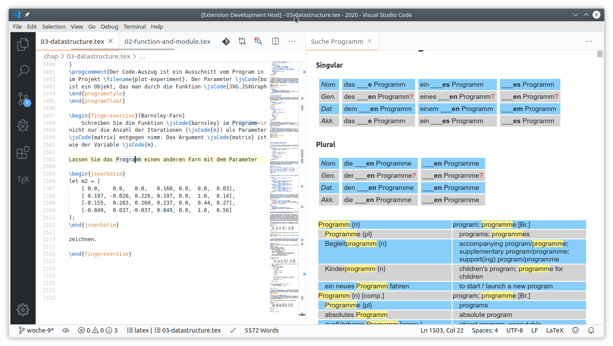

# dxtionary README

Lookup a word without changing context.

## Features

* Lookup a word from German-English dictionary `de-en-dev.txt` from
    https://www-user.tu-chemnitz.de/~fri/ding/

## Usage

* After you install this Extension, you must extract the Ding-dictionary in
`${globalStoragePath}`. To do this, just try to lookup a word (S. below). This extension
will show a message with an extract button, just click it and wait for some seconds (or maybe some minutes).

* To lookup a word by typing it from keyboard: 

    - Open the Command Pallet
    - → Type `dxtionary.lookup.ui`
    - → Type your word to lookup

* To lookup a word from a open document: use shortcut `Ctrl+e` to trigger the 
    command `dxtionary.lookup.cursor`. It should open the dictionary automatically.

## Extension Settings

This extension contributes the following settings:

* This extension will extract a dictionary in the directory `${globalStoragePath}/hpb-htw.dxtionary`. In Linux it could be `${HOME}/.config/Code/User/globalStorage/hpb-htw.dxtionary`.

## Known Issues

This extension is slow!

